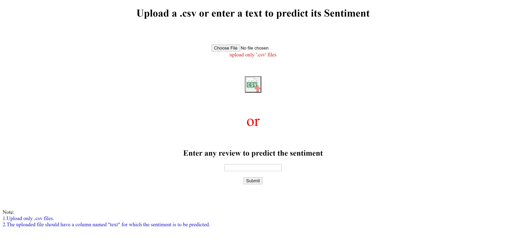
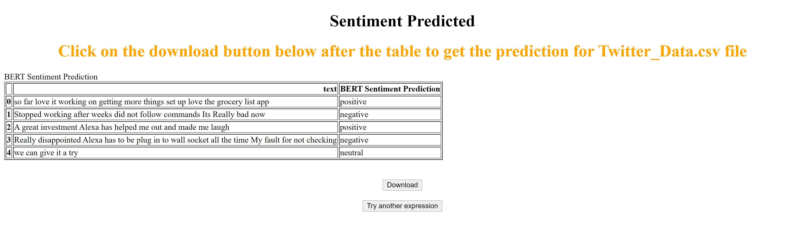

# BERT-Sentiment-analysis-Demo
BERT Sentiment analysis Demo with FLASK 

<h3>The sentiments for a review can found either by uploading a .csv file or by entering a simple text.</h3>
<h3>Case 1: Upload only .csv files.</h3>
<h3>Case 2: The uploaded a .csv file should contain a column named "text" which contains the review.</h3>
 

 
<h3>The prediction file can be downloaded using the download button after the table.</h3>

